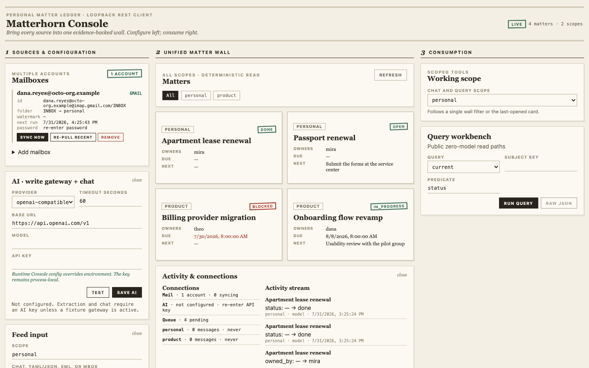

# Matterhorn

Deterministic, evidence-backed temporal memory for agents. Feed messages in;
get matters whose status, owners, blockers, and history are derived from
persisted evidence—not generated at answer time.

## Live demo →

**[Email matter ledger](https://misshqiong.github.io/matterhorn/demo/email-ledger.html)** —
a vendor project distilled from 18 emails: slipped deadlines as timeline
segments, a decision reversal, an owner handoff filed as a ✏️ human
correction, and an overdue commitment flagged in red. Every fact links to the
source email at the bottom of the page. Also:
**[this project's own ledger](https://misshqiong.github.io/matterhorn/demo/self-ledger.html)**,
rendered by the same exporter from the repository's development history.
Both pages are single self-contained HTML files produced by
`mh export <scope> --format html` — no server, no JavaScript framework,
no external requests.

## Console

Matterhorn ships a mature three-column personal Console: configure multiple
mailboxes, AI, and Feed on the left; see one all-scope matter-card wall in the
center; use scoped chat and deterministic queries on the right. The detail
modal shows the status/progress/outcome timeline with source senders and
excerpts, and can merge duplicate cards into a canonical matter with human
provenance; merged titles remain visible as aliases and the correction is
reversible.

The Console also configures and runs the memory-only-credential
[IMAP mail connector](docs/mail.md), accepts file uploads, and provides a quick
single-message jot.

```console
pip install 'matterhorn-memory[api]'
mh console
```

The static Console and REST API share `127.0.0.1:8000`; the browser opens
`/console`, while agent clients mount the same process at `/mcp`. The browser
talks only to documented public REST endpoints. Live activity, connector
health, scope lists, and matter lists refresh about every five seconds. The
built-in fictional Dana Reyes / octo-org sample uses a packaged fixture and
needs no key.

<!-- screenshot: console-wall -->

> **Screenshot placeholder:** multiple mailbox and AI configuration, unified
> matter-card wall, modal scope-aware detail/correction/merge, and
> evidence-bearing chat.

See the [Console guide](docs/console.md).

The default loopback bind is intentional. A public deployment must add
authentication and a trusted network boundary in front; v1 multi-tenant
authentication remains a non-goal.

For one-service multi-person and multi-agent sharing, see the
[Agent-team hub topology](docs/agent-team.md).

## 📒 Development ledger

This project's own development is tracked by Matterhorn itself. The public
[MATTERS.md](MATTERS.md) is regenerated nightly by CI, the only place the
ledger runs an LLM. Anyone can reproduce the read side locally without an LLM
key from the committed `ledger/assertions.json`.

The write path turns new Git commits and GitHub activity into gated assertions,
then replaces the durable assertion export. The read path rebuilds a disposable
SQLite projection from those assertions and deterministically renders the
human-readable ledger. See [the ledger design](docs/ledger.md).

## Five-minute journey

```console
pip install 'matterhorn-memory[api]'
mkdir matterhorn-demo && cd matterhorn-demo
mh init
mh add demo-messages.yaml
mh flush demo
mh matters demo
mh console
```

`mh init` creates an idempotent local SQLite setup and a tiny offline fixture
demo. `mh matters` prints a projected matter such as:

```json
{
  "title": "Payment refactor",
  "status": "in_progress",
  "owners": ["u1"],
  "next_step": "Integration testing"
}
```

`mh console` opens the product: configure mailboxes and AI, work from one
all-scope matter wall, open matter details in a modal, and chat over a selected
scope. The packaged Dana Reyes / octo-org sample works without a key. Real
mail sync needs the mailbox credential, while real extraction and chat need a
configured AI key.

The fixture is only the demo's replaceable message-to-card extractor. For real
messages, configure an OpenAI-compatible or Anthropic write gateway in
the Console AI panel, `matterhorn.toml`, or the documented environment
variables.

## Write-gateway configuration

The Console AI panel can configure the provider at runtime. A key entered
there stays in process memory, is never written to TOML, and overrides an
environment credential until that process exits. The environment remains the
non-interactive fallback:

| Variable | Meaning |
| --- | --- |
| `MATTERHORN_PROVIDER` | `openai-compatible` or `anthropic` |
| `MATTERHORN_BASE_URL` | Provider base URL; required for OpenAI-compatible gateways |
| `MATTERHORN_MODEL` | Provider model name |
| `MATTERHORN_API_KEY` | Preferred provider credential; provider-native keys remain supported |
| `MATTERHORN_TIMEOUT` | Positive floating-point request timeout in seconds; defaults to `60` |

## Claude Code

Run setup from the Claude Code project:

```console
mh setup claude-code
mh setup claude-code --url http://127.0.0.1:8000
```

The first command writes a stdio `matterhorn` entry to `.mcp.json`; the second
writes a URL-type entry for the hub at `/mcp`. Both merge absolute-path
`SessionStart` and `SessionEnd` command hooks into `.claude/settings.json`.
Hub mode also installs a `Stop` hook so each completed turn is delivered
without waiting for session exit. All hooks fail open within the setup-enforced
two-second cap; a down service stays silent.

Manual `.mcp.json` configuration remains an alternative. Embedded stdio:

```json
{
  "mcpServers": {
    "matterhorn": {
      "type": "stdio",
      "command": "mh",
      "args": ["mcp"],
      "env": {
        "MATTERHORN_DB": "/absolute/project/matterhorn.db",
        "MATTERHORN_SCHEMA": "org-matters/v1"
      }
    }
  }
}
```

Hub URL type:

```json
{
  "mcpServers": {
    "matterhorn": {
      "type": "http",
      "url": "http://127.0.0.1:8000/mcp"
    }
  }
}
```

Then ask: **“Who owns the payment refactor, and what evidence supports that?”**
The agent uses `list_matters` and the query tools. Matterhorn does not ask a
model to compose the answer: the answer and evidence come from deterministic
projection.

## Current CLI

- Write and project: `mh init`, `mh add`, `mh ingest`, `mh extract`,
  `mh flush`, `mh dream`, `mh replay`, `mh correct`, `mh merge`, and
  `mh unmerge`.
- Read and move data: `mh matters`, `mh task`, `mh events`, `mh export`,
  `mh import`, `mh sync-status`, and `mh query` (`current`, `timeline`, `at`,
  `by-person`, `list`).
- Operate and integrate: `mh console`, `mh serve`, `mh mcp`, `mh mail`
  (`setup`, `sync`, `reset`), `mh setup` (`claude-code`), and `mh hook`
  (`session-start`, `session-end`, `turn-end`).
- Inspect and verify: `mh schema` (`list`, `show`), `mh conformance` (`run`),
  and `mh eval` (`run`).

## Two-verb SDK

```python
from matterhorn import Engine
from matterhorn.distill import OpenAICompatibleGateway

engine = Engine(
    "sqlite:///team.db",
    llm=OpenAICompatibleGateway(
        base_url="https://llm.example/v1",
        api_key="...",
        model="...",
    ),
)
receipt = engine.add(
    scope_id="team-a",
    messages=[
        {
            "id": "m1",
            "sender": {"id": "u1", "name": "Dana Reyes"},
            "text": "Production model success rate dropped; I added a fallback strategy",
            "sent_at": "2026-07-28T14:00:00+08:00",
        }
    ],
)
engine.flush("team-a")

for matter in engine.matters("team-a"):
    print(matter.title, matter.status, matter.owners, matter.blocked_by)

print(engine.task(receipt.task_id).gate)
```

`add()` persists a task and returns immediately without calling the LLM.
`wait=True` runs the same pipeline synchronously. Tasks survive process
restart and expose accepted/rejected gate counts. Reads, including
`matters()`, never call an LLM.

## Output surfaces and ownership

- Query answers and MemoryCards remain deterministic, evidence-backed reads.
- Projection changes become traceable events such as `status_changed`,
  `matter_completed`, and `value_corrected`; read them with
  `engine.events()`, `GET /v1/scopes/{scope}/events`, or `mh events`.
- `mh serve --webhook-url URL` delivers event batches at least once with
  bounded retry. Consumers deduplicate by deterministic `event_id`.
- `mh export SCOPE` is the data-ownership handoff: one versioned JSON document
  containing the assertions, subjects, active subject merges, evidence
  lifecycle, and derived event history. `mh import` accepts it into an empty
  store and reproduces the same projections and query answers without changing
  human correction origin.

Assertions remain the asset and the only source of truth. Events are generated
from projection diffs, while intervals and MemoryCards are rebuildable views.
This portable ownership boundary is central to trusting an open-source memory
engine with durable team knowledge.

## The promise boundary

```text
Public door: add(messages)
        │
        ▼
[built-in extractor: Message → EpisodeCard, LLM best-effort, replaceable]
        │
════════╪════ Engine promise boundary ═══════════════════════════════════
        ▼
   EpisodeCard ──► validation ──► assertions ──► intervals ──► answers
        ▲          deterministic, idempotent, replayable (INV-1…INV-14)
        │
Advanced door: add_cards(episode_cards)
```

Below the card is best-effort extraction. From the evidence-backed card through
every answer is Matterhorn's hard deterministic promise. A new input form is
accepted only when it maps losslessly to that card contract without weakening
provenance.

Within a flush, the engine never mixes conversations in one extraction call.
It orders conversation units and boundary-preserving chunks deterministically,
then refreshes known-matter anchors after every accepted chunk. A matter born
early in the flush can therefore receive linked progress from a later
conversation without creating a duplicate.

## Progressive disclosure

- `engine.query.current/timeline/at/by_person` exposes bi-temporal detail.
- `engine.correct(...)` appends a higher-priority human assertion without
  deleting history.
- `engine.add_cards(...)` is the advanced direct card door.
- `engine.add_records(...)` remains importable for provider integrations but
  is not the README front door.
- `ingest(...)` is a deprecated alias for `add_cards(...)`.

Service mode exposes resource-style REST endpoints under
`/v1/scopes/{scope_id}` and persistent tasks under `/v1/tasks/{task_id}`.
`mh serve` alone runs quiet-period auto-flush (10 minutes by default);
it can also honor a UTC `daily_flush_at = "HH:MM"` and push event webhooks.
Embedded mode remains host-driven through `flush()` or `wait=True`.

The normative contract is [spec/SPEC.md](spec/SPEC.md). Its 63
language-neutral golden cases include the Message door, conversation-scoped
rolling extraction, boundary chunk determinism, and receipt/flush replay:

```console
$ mh conformance run
SUMMARY passed=63 failed=0 total=63
```

### Extraction quality evaluation

`mh eval run` measures the current message-to-matter extraction path against
the fictional cases in [`spec/eval`](spec/eval/README.md). With no
`MATTERHORN_PROVIDER`, it auto-detects the sibling offline response fixtures;
configure a production provider to capture a live baseline instead. The plain
table and optional `--json report.json` include over-splitting, wrong merges,
wrong/missed attachment, field accuracy, evidence validity, and fuzzy title
matching. Scores are measurements, so a completed run exits zero even when a
score is poor; fixture, dataset, gateway, and output errors remain failures.

```console
$ mh eval run --provider fixture-file --json eval-report.json
```

## Guides

- [Getting started](docs/getting-started.md)
- [Console operating surface](docs/console.md)
- [IMAP mail connector](docs/mail.md)
- [Self-hosted development ledger](docs/ledger.md)
- [Core concepts and the promise boundary](docs/core-concepts.md)
- [MCP and Claude Code](docs/mcp-claude-code.md)
- [Agent-team hub topology](docs/agent-team.md)
- [Human correction](docs/corrections.md)
- [Events and webhook delivery](docs/webhooks.md)
- [Slack and Record integrations](docs/slack.md)
- [Schema authoring](docs/schema-authoring.md)
- [PostgreSQL deployment](docs/postgresql.md)
- [Positioning alongside L1 tools](docs/positioning.md)

Development:

```console
.venv/bin/python -m pytest -q
.venv/bin/ruff check src tests
```

Matterhorn requires Python 3.11+ and is licensed under Apache-2.0.
